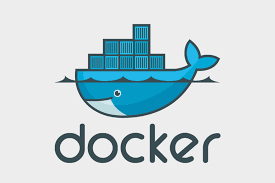

# DevOps Projects

## Descrição

Meu portfólio DevOps, consiste em um repositório que é gerenciado pelo Git, onde cada branch do projeto é equivalente a uma camada de estudos da área de DevOps, tendo neste projeto o seguinte:

- Scripts em Python e Bash
- Virtualização utilizando Vagrant
- Administração de sistemas e conceitos de redes
- Containerização utilizando Docker e Kubernetes
- CI/CD utiizando Jenkins em microsserviços
- IaaC com ferramentas como Ansible e Terraform
- Diversas soluções da AWS, como EC2, S3, Cloudformation e etc.

# Tabela de conteúdo

- [Tabela de Conteudo](#tabela-de-conteudo)
  - [Branches](#branches)
    - [Introdução VMs](#introdução-vms)
    - [Setup Local](#vprofile-em-vm)
    - [Introdução Containers](#introdução-containers)
    - [Bash Scripts](#bash-scripts)
  - [Tecnologias](#tecnologias)

## Branches

### Introdução VMs

Nesta branch está hospedado 8 máquinas virtuais, utilizando o Vagrant sendo cada uma uma variante da
forma que eu fiz, e dentro das pastas "ubuntu18" e "centos7" estão arquivos do histórico de comandos
usados, sendo também meu treino de
administração de sistemas

#### Pastas

- IaaC - VMs utilizando IaaC com scripts bash
  - website
    - Website estático hospedado usando apache httpd com script para automatizar o deploy
  - wordpress
    - Site feito em wordpress usando script para automatizar o deploy
- centos7
  - Máquina virtual simples
- data
  - Pasta compartilhada entre algumas VMs
- multi-vm
  - Vagrantfile utilizando múltiplas VMs
- ubuntu18
  - Máquina virtual simples
- website
  - Máquina virtual com serviço de httpd servindo uma página estática
- wordpress
  - Máquina virtual com wordpress instalado e configurado

### VProfile em VM

Nesta branch está hospedado um sistema feito utilizando Spring Boot que se utiliza de uma arquitetura que possui
cinco serviços principais, sendo eles Nginx para balanceamento de carga, uma aplicação em Java que é hospedada
no servidor Tomcat, serviço de mensageria com o RabbitMQ, serviço de cache utilizando o Memchached e banco
de dados utilizando o MySQL.
Para atender todas essas necessidades foram criadas 5 máquinas virtuais, todas num arquivo Vagrantfile e com duas
versões, uma sendo feita de forma manual e outra que é com IaaC

#### Pastas

- automated-provisioning
  - Vagrantfile único sendo provisionado usando scripts em shell
- manual-provisioning
  - Vagrantfile único servindo todos serviços de forma manual

### Introdução Containers

Nesta branch está hospedada três pastas, todas utilizando o Docker como ferramenta para se fazer o deploy de uma
aplicação, juntamente a uma máquina virtual, além da aplicação prática de microsserviços com uma aplicação inteira rodando no Docker

#### Pastas

- basics
  - VM com website estático rodando no servidor Apache
- microservices
  - VM que possui uma aplicação divida em microsserviços, sendo eles:
    - Frontend com Angular
    - API em Java para gerenciamento de produtos específicos
    - API em NodeJs para gerenciamento de usuários e dados gerais
    - Nginx servindo como API Gateway
- vprofile-containers
  - VM Configurada para ser exatamente o mesmo que o projeto anterior mas rodando em containers

### Bash Scripts

Nesta branch estão hospedados scripts, onde possuem diversos conceitos de lógica de programação e serviços de
automação usando o interpretador Bash

#### Scripts

- 1_firstscript.sh
- 2_websetup.sh
- 3_vars_websetup.sh
- 4_dismantle_websetup
- 5_args_websetup.sh
- 6_system_status.sh
- 7_testvars.sh
- 8_user_input.sh
- 9_conditionals.sh
- 10_conditionals.sh
- 11_conditionals.sh
- 12_monit.sh
- 13_monit.sh
- 14_for_loop.sh
- 15_for_loop.sh
- 16_while_loop.sh
- 17_while_loop.sh
- 18_multios_websetup.sh
- 19_webdeploy.sh

## Tecnologias

As seguintes ferramentas e conceitos foram usados na construção do projeto:

- [Vagrant](https://www.vagrantup.com/)
- [Ubuntu18](https://ubuntu.com/)
- [Centos7](https://www.centos.org/)
- [Docker](https://www.docker.com/)
- [Bash](https://www.gnu.org/software/bash/)

### Autor

[Matheus Dantas Ricardo 😎](https://www.linkedin.com/in/matheus-dr/)

Feito por Matheus Dantas Ricardo 👋🏽 Entre em contato!

[matheus-dr@proton.me](mailto:matheus-dr@proton.me)

