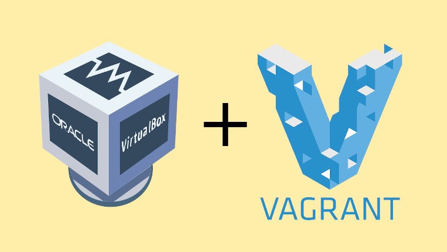

# DevOps Projects

## Descrição

Meu portfólio DevOps, consiste em um repositório que é gerenciado pelo Git, onde cada branch do projeto é equivalente a uma camada de estudos da área de DevOps, tendo neste projeto o seguinte:

- Scripts em Python e Bash
- Virtualização utilizando Vagrant
- Administração de sistemas e conceitos de redes
- Containerização utilizando Docker e Kubernetes
- CI/CD utiizando Jenkins em microsserviços
- IaaC com ferramentas como Ansible e Terraform
- Diversas soluções da AWS, como EC2, S3, Cloudformation e etc.

# Tabela de conteúdo

- [Tabela de Conteudo](#tabela-de-conteudo)
  - [Branches](#branches)
    - [Introdução VMs](#introdução-vms)
    - [VProfile em VM](#vprofile-em-vm)
    - [Introdução Containers](#introdução-containers)
    - [Bash Scripts](#bash-scripts)
    - [AWS-Intro](#aws-intro)
    - [VProfile em AWS](#vprofile-em-aws)
    - [Refactor Vprofile AWS](#refactor-vprofile-aws)
  - [Tecnologias](#tecnologias)

## Branches

### Introdução VMs

Nesta branch está hospedado 8 máquinas virtuais, utilizando o Vagrant sendo cada uma uma variante da
forma que eu fiz, e dentro das pastas "ubuntu18" e "centos7" estão arquivos do histórico de comandos
usados, sendo também meu treino de
administração de sistemas

#### Pastas

- IaaC - VMs utilizando IaaC com scripts bash
  - website
    - Website estático hospedado usando apache httpd com script para automatizar o deploy
  - wordpress
    - Site feito em wordpress usando script para automatizar o deploy
- centos7
  - Máquina virtual simples
- data
  - Pasta compartilhada entre algumas VMs
- multi-vm
  - Vagrantfile utilizando múltiplas VMs
- ubuntu18
  - Máquina virtual simples
- website
  - Máquina virtual com serviço de httpd servindo uma página estática
- wordpress
  - Máquina virtual com wordpress instalado e configurado

### VProfile em VM

Nesta branch está hospedado um sistema feito utilizando Spring Boot que se utiliza de uma arquitetura que possui
cinco serviços principais, sendo eles Nginx para balanceamento de carga, uma aplicação em Java que é hospedada
no servidor Tomcat, serviço de mensageria com o RabbitMQ, serviço de cache utilizando o Memchached e banco
de dados utilizando o MySQL.
Para atender todas essas necessidades foram criadas 5 máquinas virtuais, todas num arquivo Vagrantfile e com duas
versões, uma sendo feita de forma manual e outra que é com IaaC

#### Pastas

- automated-provisioning
  - Vagrantfile único sendo provisionado usando scripts em shell
- manual-provisioning
  - Vagrantfile único servindo todos serviços de forma manual

### Introdução Containers

Nesta branch está hospedada três pastas, todas utilizando o Docker como ferramenta para se fazer o deploy de uma
aplicação, juntamente a uma máquina virtual, além da aplicação prática de microsserviços com uma aplicação inteira rodando no Docker

#### Pastas

- basics
  - VM com website estático rodando no servidor Apache
- microservices
  - VM que possui uma aplicação divida em microsserviços, sendo eles:
    - Frontend com Angular
    - API em Java para gerenciamento de produtos específicos
    - API em NodeJs para gerenciamento de usuários e dados gerais
    - Nginx servindo como API Gateway
- vprofile-containers
  - VM Configurada para ser exatamente o mesmo que o projeto anterior mas rodando em containers

### Bash Scripts

Nesta branch estão hospedados scripts, onde possuem diversos conceitos de lógica de programação e serviços de
automação usando o interpretador Bash

#### Scripts

- 1_firstscript.sh
  - Um script básico de hello world
- 2_websetup.sh
  - Script básico para automatizar o setup de um site no serviço de httpd
- 3_vars_websetup.sh
  - O mesmo script anterior mas com variáveis
- 4_dismantle_websetup
  - Script para remoção de todo o setup feito
- 5_args_websetup.sh
  - O mesmo script utilizando argumentos do terminal
- 6_system_status.sh
  - Script para ver o estado do sistema
- 7_testvars.sh
  - Script utilizado para se entender o conceito de parentesco e variáveis globais
- 8_user_input.sh
  - Script recebendo dados do usuário em tempo de execução
- 9_conditionals.sh
  - Script utilizando estrutura if simples
- 10_conditionals.sh
  - Script utilizando estrutura if-else
- 11_conditionals.sh
  - Script utilizando estrutura de if-else encadeado
- 12_monit.sh
  - Script para monitorar se o serviço de httpd está rodando
- 13_monit.sh
  - O mesmo script mas usando uma condicional diferente
- 14_for_loop.sh
  - Script usando loop básico com for
- 15_for_loop.sh
  - Script para automatizar a criação de usuários
- 16_while_loop.sh
  - Script básico usando while loop
- 17_while_loop.sh
  - O mesmo script mas infinito
- remote-web-setup/
  - Pasta onde possui scripts para se rodar em outras máquinas via ssh, com configuração anterior entre elas
  - 18_multios_websetup.sh
    - Script para automatizar o webdeploy, mas agora para suporte às distribuições Linux baseadas Debian
  - 19_webdeploy.sh
    - Script para se mandar o script anterior e rodar ele na máquina via ssh

### AWS-Intro

Nesta branch foi aperndido os conceitos de diversos serviços da AWS, basicamente aplicando todo o conhecimento
do curso até o momento no serviço de cloud

#### Ferramentas aprendidas

- EC2
  - Serviço de máquinas virtuais da AWS
- EBS
  - Serviço de partições e armazenamento virtual da AWS
- ELB
  - Serviço de balanceamento de carga da AWS
- Cloudwatch
  - Serviço de monitoramento e gatilhos da AWS
- EFS
  - Serviço de sistema de arquivos compartilhados entre Instâncias EC2 da AWS
- S3
  - Serviço de armazenamento de objetos da AWS
- RDS
  - Serviço de gerenciamento e configuração de bancos de dados da AWS

### VProfile em AWS

Esse projeto não possui uma branch própria, visto que ele é a mesma aplicação feita na [VProfile em VM]
(#vprofile-em-vm), e tendo o diferencial de ser totalmente escalável e feita com uma arquitetura para cloud

#### Passos do setup

1. Criação dos pares de segurança
2. Criação dos grupos de segurança
3. Lançar instâncias utilizando user data (Bash Scrripts)
4. Atualizar o IP para o mapeamento de nomes no serviço de Route 53
5. Buildar aplicação a partir do código fonte
6. Fazer o upload para um bucket S3
7. Baixar o artefato para a instância EC2 do Tomcat
8. Configurar ELB com HTTPS
9. Mapear o endpoint para um nome do website no Godaddy DNS
10. Configurar gatilhos para o escalonamento automático para instâncias Tomcat

### Refactor Vprofile AWS

Este projeto consiste em refatorar o trabalho do projeto anterior utilizando os serviços próprios da AWS,
sendo a principal mudança a utilização de máquinas virtuais para os serviços de banco de dados, RabbitMQ e Memchached
para RDS, ActiveMQ and Elasticache

#### Passos do setup

1. Criar par de segurança para o Beanstalk
2. Criar grupo de segurança para Elasticache, ActiveMQ e RDS
3. Criar:

- RDS
- Elasticache
- ActiveMQ

4. Criar ambiente do Beanstalk
5. Atualizar o grupo de segurança do backend para permitir o Beanstalk
6. Atualizar o grupo de segurança do backend para permitir tráfego interno
7. Inicializar banco de dados
8. Fazer configuração de health check para o Beanstalk
9. Adicionar o listener HTTPS para o ELB
10. Buildar aplicação com as variáveis do backend
11. Fazer deploy da aplicação no Beanstalk
12. Criar CDN usando o Cloudfront e certificado SSL
13. Atualizar o domínio no Godaddy

## Tecnologias

As seguintes ferramentas e conceitos foram usados na construção do projeto:

- [Vagrant](https://www.vagrantup.com/)
- [Ubuntu18](https://ubuntu.com/)
- [Centos7](https://www.centos.org/)
- [Docker](https://www.docker.com/)
- [Bash](https://www.gnu.org/software/bash/)
- [AWS-EC2](https://aws.amazon.com/pt/ec2/)
- [AWS-EBS](https://aws.amazon.com/pt/ebs/)
- [AWS-ELB](https://aws.amazon.com/pt/elasticloadbalancing/)
- [AWS-Cloudwatch](https://aws.amazon.com/pt/cloudwatch)
- [AWS-EFS](https://aws.amazon.com/pt/efs/)
- [AWS-S3](https://aws.amazon.com/pt/s3)
- [AWS-RDS](https://aws.amazon.com/pt/rds)
- [AWS-Route 53](https://aws.amazon.com/pt/route53/)
- [AWS-Beanstalk](https://aws.amazon.com/pt/elasticbeanstalk/)
- [AWS-Cloudfront](https://aws.amazon.com/pt/cloudfront/)

### Autor

[Matheus Dantas Ricardo 😎](https://www.linkedin.com/in/matheus-dr/)

Feito por Matheus Dantas Ricardo 👋🏽 Entre em contato!

[matheus-dr@proton.me](mailto:matheus-dr@proton.me)

